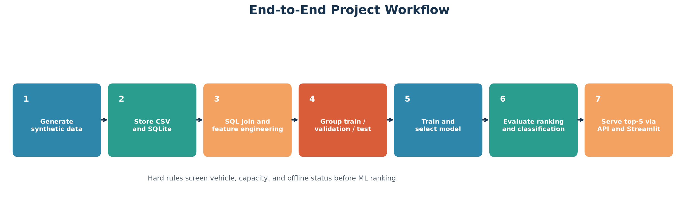
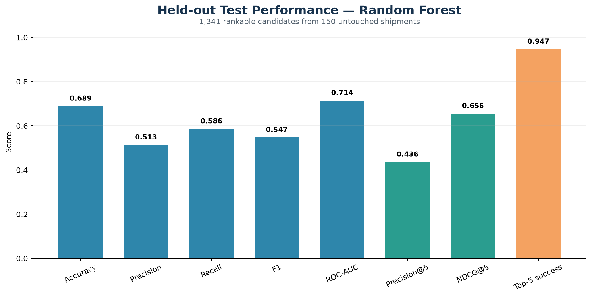
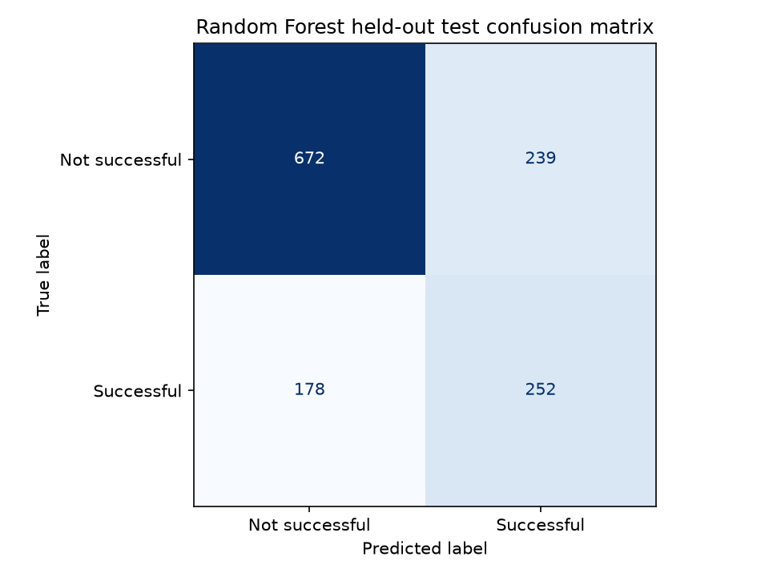
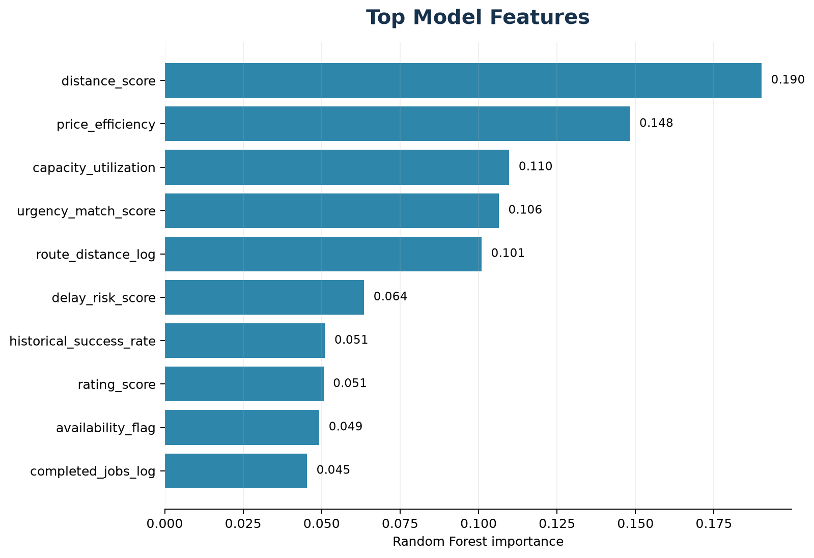
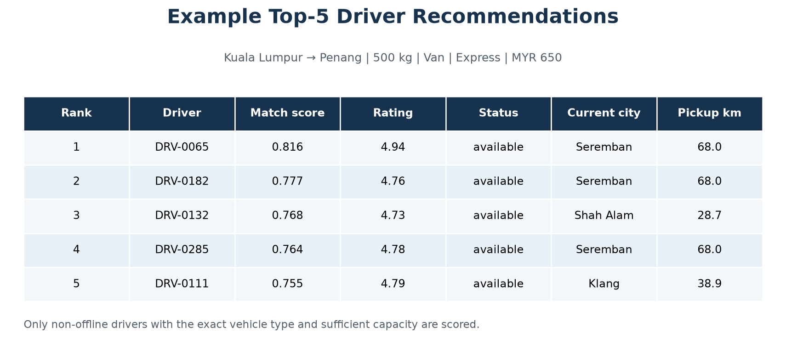

# Logistics Driver Matching and Recommendation System

[](https://github.com/coldjeffry12/logistics-driver-matching-ml/actions/workflows/tests.yml)


[](https://logistics-driver-matching-ml-aldmp73kjkhhj9jbuhl4hx.streamlit.app)

An end-to-end machine learning portfolio prototype that filters infeasible
drivers and ranks the best candidates for shipment orders.

> **Portfolio disclaimer:** This project uses locally generated synthetic
> data. It is not a production dispatch system and does not claim real company
> data, production deployment, business impact, or operational adoption.

## Live Demo and Repository

- **GitHub repository:** [coldjeffry12/logistics-driver-matching-ml](https://github.com/coldjeffry12/logistics-driver-matching-ml)
- **Live Streamlit demo:** [Open the public demo](https://logistics-driver-matching-ml-aldmp73kjkhhj9jbuhl4hx.streamlit.app)
- **Local FastAPI docs:** `http://127.0.0.1:8000/docs`
- **Local Streamlit:** `http://localhost:8501`

The live demo may take around one minute during the first recommendation
because it may generate deterministic synthetic artifacts and train/load the
model on first use.

## Recruiter Summary

This repository demonstrates practical beginner-to-intermediate Machine
Learning Engineer skills across Python, SQL, data pipelines, feature
engineering, model training, grouped evaluation, recommendation ranking, API
serving, UI demonstration, testing, technical auditing, and documentation.

The system separates logistics feasibility from ML ranking:

1. Remove drivers with the wrong vehicle, insufficient capacity, or offline
   status.
2. Predict match-success scores for the remaining drivers.
3. Return the top five with plain-language reasons.

The corrected held-out Random Forest results are ROC-AUC **0.714**, F1
**0.547**, Precision@5 **0.436**, and NDCG@5 **0.656**. These metrics describe
synthetic data only.

## Problem Statement

A logistics platform may have many possible drivers or carriers for one
shipment. Some candidates are operationally impossible, while others differ
in pickup distance, availability, reliability, response speed, price, and
experience.

This prototype combines deterministic business rules with machine learning:

- Hard constraints guarantee basic feasibility.
- A model ranks softer trade-offs among feasible candidates.
- Ranking metrics evaluate recommendation order within each shipment.

## Key Features

- Reproducible generation of shipments, drivers, and historical matches
- CSV storage plus SQLite tables and SQL joins
- Fifteen explainable engineered signals
- Logistic Regression baseline and Random Forest comparison
- Shipment-grouped train, validation, and untouched test sets
- Preprocessing contained inside scikit-learn pipelines
- Accuracy, precision, recall, F1, ROC-AUC, and confusion matrices
- Precision@5, NDCG@5, and top-5 success evaluation
- Saved `joblib` model pipeline
- Top-five recommendation engine with reasons
- Typed FastAPI endpoints and interactive API documentation
- Streamlit demonstration interface
- Ten meaningful pytest tests
- Automated pytest checks with GitHub Actions
- Recruiter, interview, GitHub, audit, and application documentation
- Reproducible PowerShell helper scripts and visual reports

## Tech Stack

| Area | Technology |
|---|---|
| Language | Python 3.10+ |
| Data | pandas, NumPy |
| Machine learning | scikit-learn |
| Persistence | CSV, SQLite, joblib |
| Evaluation and visuals | scikit-learn metrics, matplotlib |
| API | FastAPI, Pydantic, Uvicorn |
| Demo | Streamlit |
| Testing | pytest |
| Local automation | Windows PowerShell |

## Project Structure

```text
logistics-driver-matching-ml/
├── README.md
├── requirements.txt
├── .gitignore
├── .github/workflows/tests.yml
├── .streamlit/config.toml
├── data/
│   ├── raw/                         # generated CSV files
│   ├── processed/                   # generated training dataset
│   └── logistics.db                 # generated SQLite database
├── models/
│   └── best_match_model.joblib      # generated model artifact
├── reports/                         # generated metrics and plots
├── scripts/
│   ├── generate_visuals.py
│   ├── run_all.ps1
│   ├── run_api.ps1
│   └── run_streamlit.ps1
├── src/
│   ├── config.py
│   ├── data_generation.py
│   ├── database.py
│   ├── feature_engineering.py
│   ├── train_model.py
│   ├── evaluate_model.py
│   ├── recommender.py
│   ├── runtime_setup.py
│   ├── api.py
│   ├── streamlit_app.py
│   └── utils.py
├── tests/
│   ├── test_artifact_and_api.py
│   ├── test_data_generation.py
│   ├── test_evaluation.py
│   ├── test_feature_engineering.py
│   ├── test_recommender.py
│   └── test_runtime_setup.py
└── docs/
    ├── screenshots/
    ├── application_summary.md
    ├── audit_report.md
    ├── demo_script.md
    ├── final_application_pack.md
    ├── final_project_pitch.md
    ├── final_setup_checklist.md
    ├── github_profile_text.md
    ├── github_upload_guide.md
    ├── interview_explanation.md
    ├── interview_questions_and_answers.md
    ├── job_match_analysis.md
    ├── project_explanation.md
    ├── resume_bullets.md
    └── streamlit_deployment_guide.md
```

Generated datasets, the database, model binaries, and generated report
artifacts are excluded from Git and can be reproduced locally.

## Dataset

The default run creates:

| Dataset | Rows | Example contents |
|---|---:|---|
| Shipments | 1,000 | Route, weight, vehicle requirement, urgency, price |
| Drivers | 300 | City, vehicle, capacity, rating, risk, availability |
| Historical candidate matches | 12,000 | Acceptance, completion, delay, rating, success label |

The target, `match_success`, requires an eligible candidate to accept and
complete the job, remain within the delay threshold, and receive an acceptable
rating. The generator includes meaningful relationships and random effects so
the target is learnable without being perfectly deterministic.

No real personal, customer, driver, or company data is used.

## Feature Engineering

| Signal | Purpose | Use |
|---|---|---|
| Pickup distance score | Rewards proximity to origin | Model input |
| Vehicle type match | Exact shipment compatibility | Hard rule |
| Capacity match | Sufficient payload capacity | Hard rule |
| Capacity utilization | Measures vehicle fit | Model input |
| Rating score | Normalized driver quality | Model input |
| Availability flag | Distinguishes available and busy | Model input |
| Price efficiency | Offer relative to estimated cost | Model input |
| Delay quality | Inverse historical delay rate | Model input |
| Cancellation quality | Inverse cancellation rate | Model input |
| Response-time score | Rewards faster responses | Model input |
| Urgency match | Availability and response interaction | Model input |
| Historical success | Prior synthetic driver quality | Model input |
| Estimated margin | Pre-match margin estimate | Reporting only |
| Route distance | Log-transformed route length | Model input |
| Completed jobs | Log-transformed experience | Model input |

Offline status is also screened before scoring. Missing values are handled by
imputers fitted inside model pipelines, not during global feature engineering.

## Modeling Approach

Two models are compared:

- **Logistic Regression:** interpretable baseline with median imputation,
  standard scaling, and class weighting.
- **Random Forest:** nonlinear tabular model with median imputation and
  balanced class weighting.

All candidate rows for one shipment remain in one data split:

- 70% training shipments
- 15% validation shipments
- 15% untouched test shipments

Model selection uses:

```text
0.70 × ROC-AUC + 0.30 × NDCG@5
```

Random Forest narrowly wins this combined validation objective because its
ranking metrics are stronger, although Logistic Regression performs better on
some validation classification metrics.

## Evaluation Results

Final Random Forest results on 1,341 rankable candidates from 150 untouched
shipments:

| Metric | Score |
|---|---:|
| Accuracy | 0.689 |
| Precision | 0.513 |
| Recall | 0.586 |
| F1 | 0.547 |
| ROC-AUC | 0.714 |
| Precision@5 | 0.436 |
| NDCG@5 | 0.656 |
| Top-5 success rate | 0.947 |

Top-5 success is easy to understand but less discriminating because several
synthetic shipments contain multiple successful candidates. Precision@5 and
NDCG@5 are more useful for discussing ranking quality.

An earlier version reported ROC-AUC 0.967. A technical audit found that the
evaluation included many candidates the live recommender would remove using
hard constraints. The corrected pipeline aligns training, evaluation, and
inference and supersedes the inflated result.

## Screenshots and Visuals

### Project workflow



### Held-out model metrics



### Confusion matrix



### Feature importance



### Recommendation example



Regenerate all images after training:

```powershell
python scripts\generate_visuals.py
```

## How to Run on Windows

Open PowerShell:

```powershell
cd C:\Users\Acer\logistics-driver-matching-ml

python -m venv .venv
.\.venv\Scripts\Activate.ps1
python -m pip install -r requirements.txt

python src\data_generation.py
python src\train_model.py
python src\evaluate_model.py
python -m pytest
python scripts\generate_visuals.py
```

Or run the complete workflow:

```powershell
.\scripts\run_all.ps1
```

If PowerShell reports that script execution is disabled, either allow locally
created scripts for your user:

```powershell
Set-ExecutionPolicy -Scope CurrentUser RemoteSigned
```

or run this repository's script once without changing the persistent policy:

```powershell
powershell.exe -NoProfile -ExecutionPolicy Bypass -File .\scripts\run_all.ps1
```

If the `python` Windows Store alias is unavailable, use:

```powershell
.\.venv\Scripts\python.exe src\data_generation.py
```

## API Usage

Start the API:

```powershell
.\scripts\run_api.ps1
```

Equivalent command:

```powershell
uvicorn src.api:app --reload
```

Open:

- Swagger documentation: `http://127.0.0.1:8000/docs`
- Health check: `http://127.0.0.1:8000/health`

Endpoints:

- `GET /health`
- `GET /drivers?limit=20`
- `GET /shipments?limit=20`
- `GET /metadata`
- `POST /recommend`

Example request:

```json
{
  "origin_city": "Kuala Lumpur",
  "destination_city": "Penang",
  "distance_km": 355,
  "shipment_weight_kg": 500,
  "required_vehicle_type": "Van",
  "delivery_urgency": "express",
  "offered_price": 650,
  "pickup_hour": 9,
  "shipment_category": "retail",
  "top_k": 5
}
```

Example response item:

```json
{
  "driver_id": "DRV-0065",
  "predicted_match_score": 0.8155,
  "vehicle_type": "Van",
  "driver_rating": 4.94,
  "reason": "Recommended because vehicle type matches, capacity is sufficient, driver rating is high, historical delay risk is low, estimated price fits the offer."
}
```

## Streamlit Demo

Start the local interface:

```powershell
.\scripts\run_streamlit.ps1
```

Equivalent command:

```powershell
streamlit run src\streamlit_app.py
```

The demo includes:

- Shipment input form
- Top-five score cards
- Recommendation score chart
- Ranked driver table
- Plain-language recommendation reasons
- Friendly missing-model and invalid-input handling

Generated data and model files are intentionally excluded from Git. On an
empty Streamlit Cloud instance, the first submitted recommendation
automatically generates the deterministic synthetic data and trains the
existing model candidates. This first request may take about one minute.
Later requests reuse the cached recommender for that running instance.

## Deployment

The public Streamlit demo is deployed from this repository's `main` branch
using `src/streamlit_app.py`:

- [GitHub repository](https://github.com/coldjeffry12/logistics-driver-matching-ml)
- [Public Streamlit demo](https://logistics-driver-matching-ml-aldmp73kjkhhj9jbuhl4hx.streamlit.app)

The first recommendation on a fresh or restarted cloud instance may take
around one minute while synthetic data and the model artifact are generated.
This deployment remains an educational portfolio demonstration, not a
production dispatch service.

See the [Streamlit deployment guide](docs/streamlit_deployment_guide.md) for
full instructions and troubleshooting.

## Testing

Run:

```powershell
python -m pytest
```

The ten tests cover:

- Synthetic schemas and row relationships
- Successful-label business constraints
- Feature validity and leakage exclusions
- Training-pipeline missing-value behavior
- Ranking metric definitions
- Recommendation ordering and score bounds
- Impossible match handling
- Saved model loading and FastAPI integration
- Deployment-time artifact readiness

GitHub Actions also runs `python -m pytest` on every push and pull request.
The workflow regenerates the synthetic data and model artifact in its
temporary runner first, allowing all ten tests to run without committing
generated datasets or model binaries.

## Limitations

- All data, labels, and driver history are synthetic.
- Historical aggregates are static rather than timestamped point-in-time
  calculations.
- City-level distances are only approximations.
- Candidate exposure and marketplace selection bias are not modeled.
- Scores are not calibrated on real operational outcomes.
- No traffic, weather, route restrictions, fairness audit, authentication,
  monitoring, drift detection, retraining service, or online experiment exists.
- FastAPI is a local demonstration service, and Streamlit is a public
  portfolio demonstration rather than a production application.

## Future Improvements

1. Train on anonymized timestamped dispatch data.
2. Create point-in-time driver history features.
3. Compare pairwise and listwise learning-to-rank methods.
4. Add real routing, traffic, service-area, and multi-stop constraints.
5. Calibrate probabilities and optimize business-specific costs.
6. Add experiment tracking, data validation, CI, monitoring, and drift checks.
7. Evaluate fairness and marketplace effects.
8. Containerize and deploy only after security and operational review.

## Interview Summary

The concise explanation is:

> I built a synthetic-data logistics prototype that applies vehicle, capacity,
> and availability rules before ranking feasible drivers with a scikit-learn
> model. I used SQL, feature engineering, grouped train/validation/test splits,
> ranking metrics, FastAPI, Streamlit, and pytest. A technical audit corrected
> an inflated first result, and the final held-out ROC-AUC is 0.714 with
> NDCG@5 of 0.656.

Supporting material:

- [Technical audit](docs/audit_report.md)
- [Interview explanations](docs/interview_explanation.md)
- [43 project interview questions](docs/interview_questions_and_answers.md)
- [Practical demo script](docs/demo_script.md)
- [Job requirement mapping](docs/job_match_analysis.md)
- [Resume and LinkedIn wording](docs/resume_bullets.md)
- [Application summaries](docs/application_summary.md)
- [Final application copy-paste pack](docs/final_application_pack.md)
- [Short final project pitch](docs/final_project_pitch.md)
- [GitHub upload guide](docs/github_upload_guide.md)
- [Streamlit deployment guide](docs/streamlit_deployment_guide.md)
- [Final setup checklist](docs/final_setup_checklist.md)

## Disclaimer

This repository is an educational portfolio prototype built with synthetic
data. It is not production-ready and should not be interpreted as evidence of
real company data access, production deployment, operational adoption,
measured business impact, or professional ownership of a live ML system.
